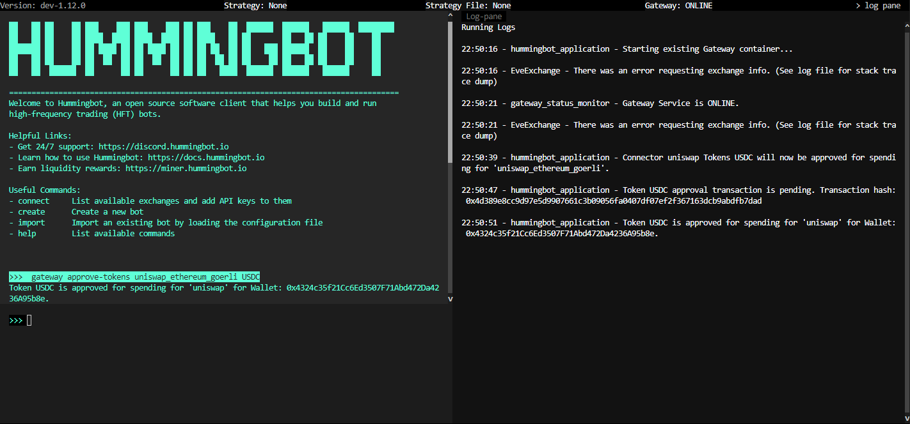
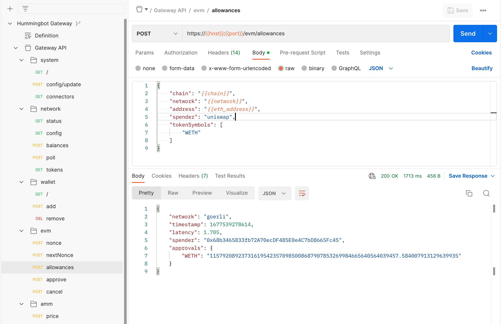

## What are Token Lists?

When trading on DEXs, you should understand how symbols map to addresses for each chain/network. Token symbols are not unique and may have duplicates or scammy clones on each network, so it's very important to be aware of which token address you are actually trading.

Hummingbot uses the [Token Lists](https://tokenlists.org/) standard to define a token dictionary for each network. For example, here are the DAI and HBOT entries from the default Token List for Ethereum Mainnet:

```json
{
    "chainId": 1,
    "address": "0x6b175474e89094c44da98b954eedeac495271d0f",
    "name": "Dai",
    "symbol": "DAI",
    "decimals": 18,
    "logoURI": "https://assets.coingecko.com/coins/images/9956/thumb/4943.png?1636636734"
},
{
    "chainId": 1,
    "address": "0xe5097d9baeafb89f9bcb78c9290d545db5f9e9cb",
    "name": "Hummingbot",
    "symbol": "HBOT",
    "decimals": 18,
    "logoURI": "https://assets.coingecko.com/coins/images/21717/thumb/PDPuf0tJ_400x400.jpg?1639863782"
},
```

When you reference the symbols DAI and HBOT in a strategy, transactions on the `ethereum_mainnet` chain/network will use its Token List to
identify the corresponding address.

## Default lists

In Gateway, each blockchain's config file defines a `tokenListType` (`FILE` or `URL`) and `tokenListSource` (path to the designated file or URL) for each network.

Starting with the [v1.11.0 release](/release-notes/1.11.0.md) the `tokenlistType` by default is `FILE`, and there is a JSON file that contains the dictionary for each network - see [ethereum.yml](https://github.com/hummingbot/gateway/blob/main/src/templates/ethereum.yml) as an example.

This reduces latency compared to accessing the Token List via URL, but users are free to change this setting by configuring the `tokenListType` and `tokenListSource` parameters for each network - see [Updating config parameters](/gateway/setup/#updating-config-parameters)

## Adding tokens to a list

Go to [Token Lists](https://tokenlists.org/) and look for a list that contains the tokens you wish to trade. You can download the list change `tokenListType` and `tokenListSource` to refer to it, or copy the token entries that you need into the default Token List.

## Approving tokens

On Ethereum and EVM-compatible chains, wallets need to **approve** other addresses (such as DEXs) before transferring tokens to them. You can inspect the **allowance** for a spender address to see how much of a specific token you can tranfer to it.

When you `start` a strategy or script, Gateway automatically checks whether both base and quote tokens are approved for the DEX that you are using. If they are not approved or if allowance is insufficient, you will see an log message like "Waiting for allowances.." and the strategy will not start.

Here is how you can approve tokens:

### Use `approve-token` command

Hummingbot has a command that allows you to approve tokens for spending on Gateway one token at a time.

Here is an example of the approve-tokens command:

```python
>>> gateway approve-tokens uniswap_ethereum_goerli WETH
```

[](../assets/approve-tokens-command.png)

### Use `/evm/approve` in Postman

Alternatively, you can call the `/evm/approve` endpoint directly from Postman. Afterwards, you can paste the `hash` value in the response in the `txHash` parameter in `network/poll` endpoint to check when the transaction is confirmed.

[](../assets/postman-approve.png)

After it's confirmed, you can use the `/evm/allowances` endpoint to check whether the approval was successful:

[](../assets/postman-allowances.png)

## Testnet faucets

An testnet faucet is a tool that allows developers and users to obtain testnet ETH or other test assets for free. Testnet ETH is a cryptocurrency that is used exclusively for testing purposes on the Ethereum network and has no real-world value.

Using an Ethereum testnet faucet is a simple process that involves the following steps:

1. Visit a faucet website for your [chain](/chains). For example, see [Ethereum](/chains/ethereum) for a list of testnet faucets.

2. Enter your testnet wallet address where indicaated.

3. Complete any additional verification steps: Depending on the testnet faucet you are using, you may be required to complete additional verification steps, such as solving a captcha or proving that you are not a robot.

4. Receive your testnet ETH: After you have completed the verification steps, the testnet ETH will be sent to your Ethereum testnet address. You can then use this ETH to experiment with the Ethereum testnet network.

## Wrapped tokens

DEXs like Uniswap and TraderJoe automatically wrap native tokens that are not ERC-20, so that users can trade native tokens such as `ETH` and `AVAX` through the interface. Behind the scenes, these exchanges automatically wrap these tokens into ERC-20 compliant `WETH` and `WAVAX` tokens.

Gateway does not auto-wrap tokens by default,

so users need to wrap native tokens into ERC-20 tokens before using them with Gateway. As of the `v1.4.0` release, there is no error message that lets you know if the token can't be used when it's not wrapped and instead will just display ``"Markets are not ready"`` but we are working on adding more informative messages within the next few releases.
