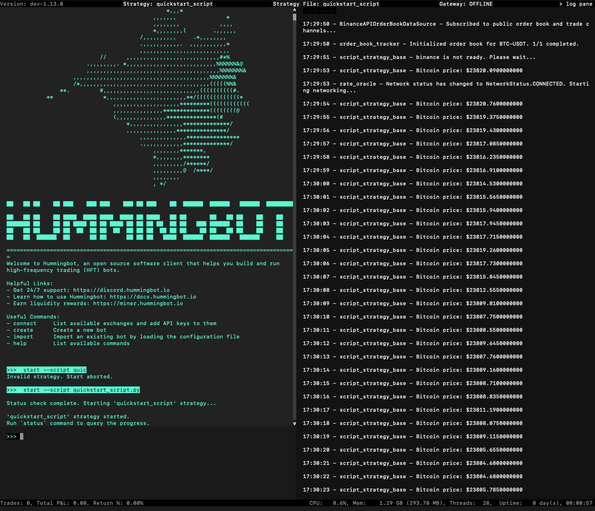

# Exercise I: Hello World Script

## Let's code

Open the codebase in your favorite IDE and follow these steps:

Add the following file inside the scripts folder: `quickstart_script.py`

Open the file and write this code:**

```Python
from hummingbot.strategy.script_strategy_base import ScriptStrategyBase


class QuickstartScript(ScriptStrategyBase):

  # It is best to first use a paper trade exchange connector 
  # while coding your strategy, once you are happy with it
  # then switch to real one.

  markets = {"binance_paper_trade": {"BTC-USDT"}}

```

Let’s code the logic that will be executed every tick_size (default=1sec)

```Python
def on_tick(self):
      price = self.connectors["binance_paper_trade"].get_mid_price("BTC-USDT")
      msg = f"Bitcoin price: ${price}"
      self.logger().info(msg)
      self.notify_hb_app_with_timestamp(msg)
```

**Explanation:**

- `on_tick` runs for every tick the bot internal clock executes (by default a new tick is generated every 1 second).
- All the connectors that you defined on `markets` are initialized when the script starts. You can access them in the class by calling `self.connectors`, which is a dictionary with the following structure: Dict[”connector_name”, ConnectorBase].
- To get the mid-price of Bitcoin, we are using the connector `binance_paper_trade` by doing `self.connectors["binance_paper_trade"].get_mid_price("BTC-USDT")`. So the logic to get any mid-price is: `self.connectors[connector_name].get_mid_price(trading_pair)`. (Make sure that they are defined in markets before using them)
- `self.logger().info(msg)` logs the message to your Hummingbot app log panel and to `logs/log_quickstart_script.log` file
- `self.notify_hb_app_with_timestamp(msg)` sends the message to your output panel (top left). If you have set up [Telegram bot integration](https://hummingbot.org/global-configs/telegram/), you will get the message on your Telegram chat as well.

Open a terminal and run the client with `./bin/hummingbot.py`. (Make sure that the conda environment is activated)

Run the command: `start --script quickstart_script.py`. You should have the following output.



Run the `status` command to see the current status of your running script:


!!! Code
    <https://gist.github.com/cardosofede/1a37db4ebc02440d8fb1352fc324e531>

## Notes and Tips

- You can define multiple connectors and multiple trading pairs, e.g.

```
markets = { "binance_paper_trade": {"BTC-USDT", "ETH-USDT"}, 
            "kucoin_paper_trade": {"LUNA-USDT"}
          }
```

- You will see a sqlite database (`/data/script1.sqlite`) and a log file (`/logs/log_script1.log`) created for your script

- Your script is loaded up at runtime, so you don’t have to exit Hummingbot while you are updating your script code. You will just need to `stop` (to stop the current execution) and start it again with the command `start --script script.py` again.

- If you want to use a real connector instead of a paper trade one, first you need to configure it using the `connect` command and provide all the required API credentials

- Use arrow up key in the client to cycle through the list of previous commands

- Use [DBeaver](https://dbeaver.io/) or another free database management tool) to open the sqlite database to see what the data that Hummingbot stores for you
